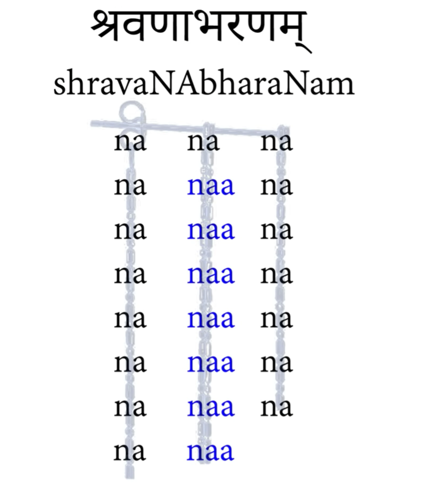

# Mahishasura Mardhini

Poetic Meter: śravaṇābharaṇam श्रवणाभरणम्

అయి గిరినందిని నందితమేదిని విశ్వ-వినోదిని నందనుతే

గిరివర వింధ్య-శిరో‌உధి-నివాసిని విష్ణు-విలాసిని జిష్ణునుతే |

భగవతి హే శితికంఠ-కుటుంబిణి భూరికుటుంబిణి భూరికృతే

జయ జయ హే మహిషాసుర-మర్దిని రమ్యకపర్దిని శైలసుతే || 1 ||

Ai Giri Nandini Nanditha Medini Vishwa Vinodhini Nanda Nuthe

Girivara Vindhya Shirodhini Vassini Vishnu Vilassini Jishnu Nuthe |

Bhagawathi Hey Shithi Kantha Kutumbini Bhuri Kutumbini Bhuri Krithe

Jaya Jaya Hey Mahishasura Mardhini Ramya Kapardhini Shaila Suthe || 1 ||

**Ai** – Divine Supreme Mother,

**Giri Nandini** – Daughter of the king of the mountains,

**Nanditha Medini** – 1) Worthy of prayer 2) Sita – daughter of Mother Earth,

**Vishwa Vinodini** – Universal power that brings life to the Universe,

**Nanda Nuthe** – Praised by Nanda, foster father of Lord Krishna,

**Girivara Vindhya** – Vindhya Mountains ,

**Shirodhini Vassini** – Resident of the peak of the mountain range,

**Vishnu Vilassini** – Worshipped by Lord Vishnu,

**Jishnu Nuthe –** Worshipped and adored by Lord Indra, **Bhagavathi** – Mahalakshmi,

**Hey** – Calling Mother with respect, **Shithi Kantha** – Wife of Lord Shiva,

**Bhuri Kutumbini** – Mother of the whole universe,

**Bhuri Krithe** – Fulfiller of all wishes, guardian of the entire universe,

**Jaya Jaya –** More and more victorious, **Hey** – Hailing Mother with respect and affection, **Mahishasura Mardhini –** Slayer of the demon Mahishasur,

**Ramya Kapardhini** – Elegant and beautiful hair (Tribute to the charm and beauty of the Goddess),

**Shaila Suthe** – Daughter of Shailendra , Lord of the mountains

---

సురవర-హర్షిణి దుర్ధర-ధర్షిణి దుర్ముఖ-మర్షిణి హర్షరతే

త్రిభువన-పోషిణి శంకర-తోషిణి కల్మష-మోషిణి ఘోషరతే |

దనుజ-నిరోషిణి దితిసుత-రోషిణి దుర్మద-శోషిణి సింధుసుతే

జయ జయ హే మహిషాసుర-మర్దిని రమ్యకపర్దిని శైలసుతే || 2 ||

Suravara Varshini Durdhara Dharshini Durmukha Marshini Harsharathe

Tribhuvana Poshini Shankara Toshini Kilbisha Moshini Ghosharathe

Dhanujani Roshini Dhithisutha Roshini Durmadha Shoshini Sindhusuthe

Jaya Jaya Hey Mahishasura Mardhini Ramya Kapardhini Shaila Suthe

**Suravara Varshini** – Bestower of innumerable boons to the Devas,

**Durdhara** – A demon , **Durmukha** – Another demon She stayed,

**Harsharathe** – Creating joy &amp; happiness by ending evil,

**Tribhuvana Poshini** – Giver of food &amp; sustenance to the 3 worlds,

**Shankara Toshini** – One who pleases Lord Shiva immensely,

**Kilbisha Moshini** – One who abolishes sin and its ill effects,0

**Ghosharathe** – Elimiates sin &amp; the outcome of sin,

**Dhanujani** – Those born to Dhanu – Dhanavas,

**Dhithisutha Roshini –** One who bears anger against the sons of Dhithi (Asuras),

**Sindhu Suthe** – Hail the daughter of the King of the Oceans (Mahalakshmi)

---

అయి జగదంబ మదంబ కదంబవన-ప్రియవాసిని హాసరతే

శిఖరి-శిరోమణి తుఙ-హిమాలయ-శృంగనిజాలయ-మధ్యగతే |

మధుమధురే మధు-కైతభ-గంజిని కైతభ-భంజిని రాసరతే

జయ జయ హే మహిషాసుర-మర్దిని రమ్యకపర్దిని శైలసుతే || 3 ||

**Ayi Jagadamba Madhamba Kadamba Vanapriya Vaasini HaasaratheShikhari Shiromani Tungaahimalaya Shringanijaalaya MadhyagatheMadhu Madhure Madhu Kaithabha Ghanjini Kaithabha Bhanjini RaasaratheJaya Jaya Hey Mahishasura Mardhini Ramya Kapardhini Shaila Suthe**

**Ayi Jagadamba – Universal Mother,**

**Madhamba – Mother to all creations,**

**Kadamaba Vanapriya Vassini – Fond of the evergreen forests of the mountains, who resides there,**

**Hassarathe – One who always maintains a gentle smile,**

**Madhu Madhure – One who is nectar , the very power of Vishnu,**

**Madhu Kaithabha Ghanjini – Vanquisher of two demons Madhu &amp; Kaithabha,**

**Kaithabha Bhanjini – Inflicts pain and harasses the demon,**

**Raasarathe – Provides Divine enjoyment and indulges in it.**

---

అయి శతఖండ-విఖండిత-రుండ-వితుండిత-శుండ-గజాధిపతే

రిపు-గజ-గండ-విదారణ-చండపరాక్రమ-శౌండ-మృగాధిపతే |

నిజ-భుజదండ-నిపాటిత-చండ-నిపాటిత-ముండ-భటాధిపతే

జయ జయ హే మహిషాసుర-మర్దిని రమ్యకపర్దిని శైలసుతే || 4 ||

**Ayi Shatha Khanda Vikhandita Runda Vithunditha Shunda Gajaadipathe**

**Ripugaja Ganda Vidharuna Chanda Parakraama Shunda Mrigaadhi Pathe** |

**Nija Bhuja Dhanda Nipathith Khanda Vipathitha Munda Bhataadipathe**

**Jaya Jaya Hey Mahishasura Mardhini Ramya Kapardhini Shaila Suthe** || 4 ||

**Ayi** – Divine Mother,

**Shatha Khanda** – One who cuts enemy into over 100 pieces,

**Vikhandita Runda** – Into tiny atoms,

**Vithunditha** – Demolishes the enemy to the depth of doom,

**Shunda Gajaadipathe** – Brutally destroys Shunda and his army of elephants,

**Ripugaja Ganda** – Punishes all the elephants in the enemies&#39; camp,

**Vidharuna Chanda** – Army of Demon Chanda scatters hither and thither,

**Parakrama Shunda** – Devis might &amp; valour against Asura Sunda,

**Mrigaadhi Pathe** – Vechile of Godess the Lion strikes Munda&#39;s forehead and despatches all his elephant army to death,

**Nija Bhuja** – With her own hands, **Dhanda** – delivers punishment,

**Nipathitha Khanda** – Endless flow of Divine weapons,

**Vipathitha Munda**** Bhataadipathe**– Wields a brilliant divine sword like lightning and destroys Chanda &amp; Munda and their entire army singlehandedly.

---

అయి రణదుర్మద-శత్రు-వధోదిత-దుర్ధర-నిర్జర-శక్తి-భృతే

చతుర-విచార-ధురీణ-మహాశయ-దూత-కృత-ప్రమథాధిపతే |

దురిత-దురీహ-దురాశయ-దుర్మతి-దానవ-దూత-కృతాంతమతే

జయ జయ హే మహిషాసుర-మర్దిని రమ్యకపర్దిని శైలసుతే || 5 ||

**Ayi Rana Dhurmadha Shathru Vadhoodhitha Dhurdhara Nirjara Shakti Bruthe**

**Chatura Vichaara Dhureena Maha Shiva Dhoothakritha Pramadhipathe** |

**Dhuritha Dhureeha Dhuraashaya Dhurmathi Danava Dhootha Kruthaantha Mathe**

**Jaya Jaya Hey Mahishasura Mardhini Ramya Kapardhini Shaila Suthe** || 5 ||

**Ayi** – Divine Mother,

**Rana Dhurmadha** – Defeats those with evil intentions,

**Shathru Vadhoodhitha** – Resolves to vanquish her enemies,

**Dhurdhara Nirjara** – Mercilessly eliminates Evil forces,

**Shakti Bruthe** – A profusion of infinite energy,

**Chatura Vichaara** – Uses 4 intelligent strategies to overcome challenges with the enemies,

**Dhureena Maha Shiva** – One of the Trinity

**Dhoothakritha Paramadhipathe** – Enlists the support of Lord Shiva,

**Dhuritha Dhureeha** – Eliminates evil in different circumstances,

**Dhuraashaya Dhurmathi** – Suppresses evil in many forms,

**Danava Dhootha** – Sends Shiva as an emissary to the Dhanavas,

**Kruthaantha Mathe** – Being compassionate &amp; motherly gives even the wicked Asuras a chance to reform

---

అయి శరణాగత-వైరివధూ-వరవీరవరాభయ-దాయికరే

త్రిభువనమస్తక-శూల-విరోధి-శిరోధి-కృతా‌உమల-శూలకరే |

దుమి-దుమి-తామర-దుందుభి-నాద-మహో-ముఖరీకృత-దిఙ్నికరే

జయ జయ హే మహిషాసుర-మర్దిని రమ్యకపర్దిని శైలసుతే || 8 ||

**Ayi Sharanagatha Vairi Vadhuvara Veera Varabhaya Dhayakare**

**Tribhuvana Masthaka Shoola Virodhi Shirodhi Krithamala Shoolakare** |

**Dhumi Dhumi Thamaara Dhundhubi Nada Maho Mukha Reetkritha Thigmakare**

**Jaya Jaya Hey Mahishasura Mardhini Ramya Kapardhini Shaila Suthe** || 8 ||

**Ayi** – Divine Mother,

**Sharanagatha** – Accepting those who surrender at her feet,

**Vairi Vadhuvara** – Compassionate to the wives of her enemies who surrender to her, **Veera**

**Varabhaya** – Wages war as per the rules of engagement,

**Dhayakare** – Compassionate / Giver of boons and gifts,

**Tribhuvana** – The Lord of the 3 worlds,

**Masthaka Shoola Virodhi** – Impales the enemy warriors on the forehead,

**Shirodhi Krithamala Shoolakare** – Makes a garland of the heads of the defeated and vanquished asuras on her spear,

**Dhumi Dhumi Thamaara** – Booming sound of the lotus feet of Devi as she dances the thandava dance with her anklets in the battlefield,

**Dhundhubi Nada** – Sound from her trumpet as she announces war,

**Maho Mukhari Kritha** – Her face resplendent and shining beautifully,

**Thigmakare** – The sharp shining red hot Trishul blazing in the Sun.

---

అయి నిజ హుంకృతిమాత్ర-నిరాకృత-ధూమ్రవిలోచన-ధూమ్రశతే

సమర-విశోషిత-శోణితబీజ-సముద్భవశోణిత-బీజ-లతే |

శివ-శివ-శుంభనిశుంభ-మహాహవ-తర్పిత-భూతపిశాచ-పతే

జయ జయ హే మహిషాసుర-మర్దిని రమ్యకపర్దిని శైలసుతే || 6 ||

**Ayi Nija Hoomkrithi Maathra Nirakritha Dhoomra Vilochana Dhoomra Shathe**

**Samara Vishoshitha Shonita Beeja Samudhbhava Shonitha Beeja Lathe** |

**Shiva Shiva Shumbha Nishumbha Mahaahava Tharpitha Bhutha Pishaacharathe**

**Jaya Jaya Hey Mahishasura Mardhini Ramya Kapardhini Shaila Suthe** || 6 ||

**Ayi** – Divine Mother,

**Nija Hoomkrithi** – Chants the powerful Baja Mantra &quot;Hum&quot;,

**Maathra Nirakritha Dhoomra Vilochana** – Killed the wicked asura Dhoomra Vilochana who was the commander of Shumbha and Nishumbha, whose red eyes always emitted poison

**Dhoomra Shathe** – Vanquished him in seconds,

**Samara Vishoshitha** – Devi fights a special war , not the one fought by regular solders ,

**Shonita Beeja Samudhbhava Shonitha Beeja Lathe** – Reference to a powerful Asura whose every drop of blood creates more of his form, Godess kills him by swallowing all the blood that drips from him while fighting,

**Shiva Shiva Shumbha Nishumbha** – Shumbha and Nishumbha are great devotees of Shiva,

**Mahaahava Tharpitha** – She gives them liberation by chanting the name of Lord Shiva while killing them ,

**Bhutha Pishaacharathe** – Thereby ensuring that they attain moksha and do not become ghosts and ghouls

---

ధనురనుసంగరణ-క్షణ-సంగ-పరిస్ఫురదంగ-నటత్కటకే

కనక-పిశంగ-పృషత్క-నిషంగ-రసద్భట-శృంగ-హతావటుకే |

కృత-చతురంగ-బలక్షితి-రంగ-ఘటద్-బహురంగ-రటద్-బటుకే

జయ జయ హే మహిషాసుర-మర్దిని రమ్యకపర్దిని శైలసుతే || 7 ||

**Dhanu Ranu Sanga Ranakshana Sanga Parishpura Dhanga Natak Katake**

**Kanaka Pishanga Prishatka Nishanga Rasadh Bhata Shringa Hathaa Vatuke** |

**Kritha Chaturanga Balakshiti Ranga Ghatad Bahuranga Ratad Batuke**

**Jaya Jaya Hey Mahishasura Mardhini Ramya Kapardhini Shaila Suthe** || 7 ||

**Dhanu Ranu Sanga** – Devi looks beautiful holding the Bow,

**Ranakshana Sanga** – One who uses her weapons as per the rules of the war,

**Parishpura Dhanga** – Creates a divine aura as she holds with balance and poise her bow and arrows,

**Natak Katake** – The sound from her bow and the entire atmosphere makes it feel more like a dance performance than a war,

**Kanaka Pishanga** – The enemy showers on her red and golden arrows,

**Prishatka Nishanga** – She responds to some and ignores the rest with Sringara rasa,

**Rasadh Bhata Shringa** – Devi&#39;s use of arrows and her response makes the whole performance look like a divine dance,

**Hathaa Vatuke** – She is an expert in finishing off her enemies even with this grace,

**Kritha Chaturanga** – Single handedly addresses 4 armies of the enemy,

**Balakshiti Ranga** – One who weakens the enemy,

**Ghatad Bahuranga** – Demolishes the wicked Asuras in different hues ,

**Ratad Batuke** – Her supremacy is complete, She is in total command, She is almighty.

---

జయ-జయ-జప్య-జయే-జయ-శబ్ద-పరస్తుతి-తత్పర-విశ్వనుతే

ఝణఝణ-ఝింఝిమి-ఝింకృత-నూపుర-శింజిత-మోహితభూతపతే |

నటిత-నటార్ధ-నటీనట-నాయక-నాటకనాటిత-నాట్యరతే

జయ జయ హే మహిషాసుర-మర్దిని రమ్యకపర్దిని శైలసుతే || 10 ||

**Jaya Jaya Japya Jaye Jaya Shabdha Parasthuthi Tathpara Vishwanuthe**

**Bhana Bhana Bhinjjini Bhinkritha Noopura Sinjitha Mohitha Bhutapathe** |

**Natitha Nataartha Natee Nata Nayaka Naatitha Naatya Sugaanarathe**

**Jaya Jaya Hey Mahishasura Mardhini Ramya Kapardhini Shaila Suthe** || 10 ||

The world is dazzled by seeing the divine dance of the Goddess.

**Jaya Jaya Japya Jaye** – Devotees hailing Devi and chanting in chorus for her success,

**Jaya Shabdha Parasthuthi** – She is the epitome of the word &quot;Jaya&quot; or Victory,

**Tathpara Vishwanuthe –** All her devotees and supporters enamored by her divine looks, energy, and dance chant her name in chorus for her victory,

**Bhana Bhana Bhinjjini** – Her jewelry makes a clanging noise as she dances the war dance and the whole universe looks in awe,

**Bhinkritha Noopura** – Her anklets and other jewelry on her feet make a beautiful musical sound,

**Sinjitha Mohitha Bhuta Pathe –** Looking at this beautiful dance even Lord Shiva is mesmerized,

**Natitha Nataartha –** She dances the cosmic dance like Nataraja with one feet on the ground and the other pointed towards the heavens,

**Natee Nata Nayaka –** Always by the side of her devotees and her consort,

**Naatitha Naatya Sugaanarathe –** The whole scene is captivating with the beautiful Goddess dancing and creating divine music. The Deva&#39;s and all those watching are spellbound
---
అయి సుమనః సుమనః సుమనః సుమనః సుమనోహర కాంతియుతే

శ్రితరజనీరజ-నీరజ-నీరజనీ-రజనీకర-వక్త్రవృతే |

సునయనవిభ్రమ-రభ్ర-మర-భ్రమర-భ్రమ-రభ్రమరాధిపతే

జయ జయ హే మహిషాసుర-మర్దిని రమ్యకపర్దిని శైలసుతే || 11 ||

**Ayi Sumanah Sumanah Sumanah Sumanah Sumanohara Kaanthiyuthe**

**Shritha Rajanee Rajanee Rajanee Rajanee Rajanee Kara Vakra Vrithe** |

**Sunayana Vibhrama Rabhrama Rabhrama Rabhrama Rabhrama Radhipathe**

**Jaya Jaya Hey Mahishasura Mardhini Ramya Kapardhini Shaila Suthe** || 11 ||

Here Devi is described as one with beautiful round eyes constantly scanning the universe day and night protecting her devotees from evil forces. She is compared to a full moon.

**Ayi** – Godess , **Sumanah** – Good Hearted, **Sumanohara** – Lovely physical form,

**Kaanthiyuthe** – So beautiful that everyone is attracted to Her like a magnet,

**Shritha Rajanee** – Shining like a full Moon on a dark night,

**Rajanee Rajanee Rajanee Rajanee Kara** – She is the queen of the night, creates the energy and joy and peace of the night,

**Vakra Vrithe –** Her face is perfect and beautiful like a full moon,

**Sunayana Vibhrama** – Her beautiful eyes are always on the lookout protecting her devotees from evil,

**Rabhrama Rabhrama Rabhrama Rabhrama Radhipathe –** She dazzles people with her illusionary power. She is the mistress of illusion.

---

మహిత-మహాహవ-మల్లమతల్లిక-మల్లిత-రల్లక-మల్ల-రతే

విరచితవల్లిక-పల్లిక-మల్లిక-ఝిల్లిక-భిల్లిక-వర్గవృతే |

సిత-కృతఫుల్ల-సముల్లసితా‌உరుణ-తల్లజ-పల్లవ-సల్లలితే

జయ జయ హే మహిషాసుర-మర్దిని రమ్యకపర్దిని శైలసుతే || 12 ||

**Sahitha Maha Hava Mallama Thallika Mallitha Rallaka Mallarathe**

**Virachitha Vallika Pallika Mallika Bhillika Bhillika Varga Vrithe** |

**Sithakritha Phulla Samulla Sithaaruna Thallaja Pallava Sallalithe**

**Jaya Jaya Hey Mahishasura Mardhini Ramya Kapardhini Shaila Suthe** || 12 ||

**Sahitha Maha Hava** – She is very powerful and can combat all the massive wrestlers from the enemy&#39;s army,

**Mallama Thallika** – Battles with ease with the gigantic Asura wrestlers,

**Mallitha Rallaka Mallarathe –** Wipes them out with the blink of an eyelid,

**Virachitha Vallika** – Amids the forests of Himalayas amid Pepper &amp; Jasmine creepers grows the beautiful &quot; Valli&quot; creepers,

**Pallika Mallika** – The Lizard maintains its house here,

**Bhillika Bhillika Varga Vrithe –** This is the abode of the Divine mother amid rare flowering and medicinal plants in the Himalayas.

**Sithakritha Phulla** – In this beautiful surrounding with Lily, Jasmine, and fresh grass she lives, **Samulla Sithaaruna** – Her favorite haunts are around Lily &amp; Jasmine flowers,

**Thallaja Pallava Sallalithe –** In this beautiful surrounding, with lovely flowers in full bloom emanating a beautiful fragrance the Divine mother roam around

---

అవిరళ-గండగళన్-మద-మేదుర-మత్త-మతంగజరాజ-పతే

త్రిభువన-భూషణభూత-కళానిధిరూప-పయోనిధిరాజసుతే |

అయి సుదతీజన-లాలస-మానస-మోహన-మన్మధరాజ-సుతే

జయ జయ హే మహిషాసుర-మర్దిని రమ్యకపర్దిని శైలసుతే || 13 ||

**Avirala Ganda Galanmadha Medhura Maththa Mathangaja Raaja Pathe**

**Tribhuvana Bhushana Bhootha Kalaanidhi Rupa Payonidhi Raaja Suthe**

**Ayi Sudha Theejana Laalasa Maanasa Mohana Manmatha Raaja Suthe**

**Jaya Jaya Hey Mahishasura Mardhini Ramya Kapardhini Shaila Suthe**

**Avirala Ganda** – Elephants that become intoxicated and uncontrollable when in a state of &quot; Madam&quot;,

**Galanmadha Medhura** – Elephants run amok when this liquid starts flowing between their eyes,

**Maththa Mathangaja Raaja Pathe** – All the elephants in the Devi&#39;s army including the king of the Elephants. (Ma Durga is able to make all the elephants in her army cause havoc with the enemy because she activates the secretions within their eyes that makes them uncontrollable), **Tribhuvana** – Godess of the 3 Worlds,

**Bhushana Bhootha** – Covered with beautiful Jewels, Dazzling , a protective shield around her devotees, Kalanidhi – Embodiment of all arts,

**Rupa Payonidhi** – Resides in all life forms,

**Raaja Suthe** – Daughter of the Himalayas,

**Ayi** – Godess , **Sudha Theejana** – Beautiful face, smiling , cool like the moon,

**Laalasa** – Ever displaying her enchanting form,

**Maanasa Mohana Manmatha** – Casting a spell on the minds of all not just with her beauty but her intellect,

**Raaja Suthe** – daughter of the king of the Himalayas.

---

కమలదళామల-కోమల-కాంతి-కలాకలితా‌உమల-భాలతలే

సకల-విలాసకళా-నిలయక్రమ-కేళికలత్-కలహంసకులే |

అలికుల-సంకుల-కువలయమండల-మౌళిమిలద్-వకులాలికులే

జయ జయ హే మహిషాసుర-మర్దిని రమ్యకపర్దిని శైలసుతే || 14 ||

**Kamala Dhalamala Komala Kaanthi Kallakali Thamala Bhaalalathe**

**Sakala Vilaasa Kalaanila Yakrama Keli Chalathkala Hamsakule** |

**Alikula Sankula Kuwalaya Mandala Mouli Milad Bhakulaali Kule**

**Jaya Jaya Hey Mahishasura Mardhini Ramya Kapardhini Shaila Suthe** || 14 ||

**Kamala Dhalamala** – Pearls of Lotus,

**Komala Kaanthi** – The attractive power of a beautiful Lotus,

**Kallakali Thamala** – A Beautiful face like a Lotus that brings joy to one and all,

**Bhaalalathe** – Face adorned by the crescent moon,

**Sakala** – Wholesome, **Vilaasa** – Permamnent , indestructible,

**Kalaanilaya** – Expertise in all art forms, **Krama** – Follows all the rules, steps, discipline,

**Keli Chalathkala –** Mastery of all art forms, creates and originator of forms of art\*\*,\*\*

**Hamsa Kule –** From the family of Brahma,

**Ali Kula** – Surrounded by Devi&#39;s and other forms of Sakthi , Divine Powers,

**Sam Kula** – From a. good family,

**Kuwalaya** – Lily flowers blooming in the water, Mandala – Community, Society,

**Mouli Milad Bhakulaali Kule –** Resides in thick forests surrounded by Lily, Jasmine, Bakula flowers , with bees humming around

---

కర-మురళీ-రవ-వీజిత-కూజిత-లజ్జిత-కోకిల-మంజురుతే

మిలిత-మిలింద-మనోహర-గుంజిత-రంజిత-శైలనికుంజ-గతే |

నిజగణభూత-మహాశబరీగణ-రంగణ-సంభృత-కేళితతే

జయ జయ హే మహిషాసుర-మర్దిని రమ్యకపర్దిని శైలసుతే || 15 ||

**Kara Murali Rava Veejitha Koojitha Lajjitha Kokila Manjumathe**

**Militha Pulindha Manohara Gunjitha Ranjitha Shaila Nikunjagathe** |

**Nijaguna Bhutha Maha Sabari Gana Sadhguna Sambhrita Kelithale**

**Jaya Jaya Hey Mahishasura Mardhini Ramya Kapardhini Shaila Suthe** || 15 ||

**Kara Murali Rava** – One holding and playing flute,

**Veejitha Koojitha** – Creating divine intoxication music playing the flute,

**Lajjitha** – Shy of getting carried away by the music like the Gopis were carried away by Lord Krishna&#39;s music,

**Kokila Manjumathe** – Devi creates music sweeter than that of the shy Cuckoo bird,

**Militha** – One who binds , joins , creates intimacy,

**Pulindha** – Woman of hill tribe , Devi is also originally from the Tribe of the mountains,

**Manohara Gunjitha Ranjitha** – Mingling with the Tribal women she creates music that merges with the buzzing of the bees,

**Shaila Nikunjagathe –** Creating beautiful music wandering alone in the Tribal forests of the mountains,

**Nijaguna Bhutha** – A person of superior character, Good Traits,

**Maha Sabari Gana** – Mingling with the local Sabari clan,

**Sadhguna Sambhrita –** Pure thoughts and actions,

**Kelithale –** Mingles with the local Tribal , part of her own kin

---

కటితట-పీత-దుకూల-విచిత్ర-మయూఖ-తిరస్కృత-చంద్రరుచే

ప్రణతసురాసుర-మౌళిమణిస్ఫురద్-అంశులసన్-నఖసాంద్రరుచే |

జిత-కనకాచలమౌళి-మదోర్జిత-నిర్జరకుంజర-కుంభ-కుచే

జయ జయ హే మహిషాసుర-మర్దిని రమ్యకపర్దిని శైలసుతే || 16 ||

**Katithata Peetha Dhukoola Vichitra Mayukha Thiraskritha Chandra Ruche**

**Pranatha Surasura Mauli Mani Sphura Dhanshula Sannakha Chandra Ruche** |

**Jita Kanaakachala Mauli Padhorjitha Nirbhara Kunjara Kumbhakuche**

**Jaya Jaya Hey Mahishasura Mardhini Ramya Kapardhini Shaila Suthe** || 16 ||

**Katithata Peetha** – Wearing a yellow drape on slim hips,

**Dhukoola Vichitra** – Extraordinatily beautiful, attracts one and all,

**Mayukha** – Bright form dazzles like fire,

**Thiraskritha** – Overwhelms,

**Chandra Ruche** – Equated to the brightness and the beauty of the moon,

**Pranatha Surasura** – She is worshipped by all including the Asuras,

**Mauli Mani** – Tinkling sound of bells,

**Sphura Dhanshula Sannakha** – Sparkle and glitter of ornaments from toes and feet, **Chandra**

**Ruche** – Equated to the brightness and the beauty of the moon,

**Jita Kanaakachala** – Shines brighter than the golden Meru Parvat,

**Mauli Padhorjitha** – Brightness from her body and feet infuses energy and enthusiasm in her devotees,

**Nirbhara Kunjara** – Broad Forehead,

**Kumbhakuche** – Divine Bosom shaped like the strong temples of the Elephant

---

విజిత-సహస్రకరైక-సహస్రకరైక-సహస్రకరైకనుతే

కృత-సురతారక-సంగర-తారక సంగర-తారకసూను-సుతే |

సురథ-సమాధి-సమాన-సమాధి-సమాధిసమాధి-సుజాత-రతే

జయ జయ హే మహిషాసుర-మర్దిని రమ్యకపర్దిని శైలసుతే || 17 ||

**Vijeetha Sahasra Karaika Sahasra Karaika Sahasra Karaikanuthe**

**Kritha Sura Tharaka Sangara Tharaka Sangara Tharaka Sonu Suthe** |

**Suratha Samaadhi Samaana Samaadhi Samaadhi Samaadhi Sujatharathe**

**Jaya Jaya Hey Mahishasura Mardhini Ramya Kapardhini Shaila Suthe** || 17 ||

**Vijeetha Sahasra** – Eternally Victorious,

**Karaika Sahasra Karaika Sahasra Karaikanuthe** – Very Powerful devotee who had 1000 hands and prayed to Godess and was blessed,

**Kritha Sura Tharaka** – Blessed and gave weapons to help kill the Demon Tharaka and vanquish his army ,

**Sangara Tharaaka Sangara Tharaaka** – Tharaka and his army ,

**Sonu Suthe** – The demon was killed by Subramaniam, Lord Muruga the Son of Shiva and Devi,

**Samaadhi**** Suratha Samaadhi Samaana Samaadhi Samaadhi ****Sujatharathe** – Suratha was a king and Samaadhi a Businessman. They fell in bad times and were given the Devi&#39;s Beeja Mantra to chant by Rishi Medha. Chanting that with devotion they overcame their challenges and attained Moksha

---

పదకమలం కరుణానిలయే వరివస్యతి యో‌உనుదినం న శివే

అయి కమలే కమలానిలయే కమలానిలయః స కథం న భవేత్ |

తవ పదమేవ పరంపద-మిత్యనుశీలయతో మమ కిం న శివే

జయ జయ హే మహిషాసుర-మర్దిని రమ్యకపర్దిని శైలసుతే || 18 ||

**Pada Kamalam Karuna Nilaye Varivasya Dhiyonudhi Namsha Shive**

**Ayi Kamale Kamalaa Nilaye Kamala Nilaye Sa Kathamna Bhavet** |

**Thava Padhameva Param Padha Mithyanu Sheelayatho Mama Kimna Shive**

**Jaya Jaya Hey Mahishasura Mardhini Ramya Kapardhini Shaila Suthe** || 18 ||

**Pada Kamalam** – tender Lotus feet,

**Karuna Nilaye** – Ocean of compassion, **Varivasya** – Abundance,

**Dhiyonudhi Namsha Shive** – Showers abundance and fulfils all desires of those who meditate at Her lotus feet,

**Ayi** – Divine Mother, **Kamala** – One who sits on the Lotus,

**Kamala Nilaye** – Who resides in the Lotus ( Lakshmi),

**Sa Kathamna Bhavet** – Her sincere devotees, who is always with Her, she can even transform a beggar to a multi millionaire,

**Thava Padhameva** – Your Lotus feet alone,

**Param Padha Mithyanu Sheelayatho** – When a devotee meditates on your lotus feet over time it becomes a habit,

**Mama Kimna Shive** – Such devotees are always looked after and taken care for by you, you have never ignored their prayers.

---

కనకలసత్కల-సింధుజలైరనుషింజతి తె గుణరంగభువం

భజతి స కిం ను శచీకుచకుంభత-తటీపరి-రంభ-సుఖానుభవమ్ |

తవ చరణం శరణం కరవాణి నతామరవాణి నివాశి శివం

జయ జయ హే మహిషాసుర-మర్దిని రమ్యకపర్దిని శైలసుతే || 19 ||

**Kanakala Sathkala Sindhu Jalairanu Sinjjinuthe Guna Ranga Bhuwam**

**Bhajathi Sakimna Sachee Kucha Kumbha Thatipari Rambha Sukha Anubhavam**

**Thava Charanam Sharanam Karavaani Nataamara Vaani Nivasi Shivam**

**Jaya Jaya Hey Mahishasura Mardhini Ramya Kapardhini Shaila Suthe**

**Kanakala Sathkala** – Hands adorned with jewels studded with stones she bestows all the skills and art forms (Kala &amp; Vidya)

**Sindhu Jalairanu Sinjjinuthe Guna** – Here she is praised as Saraswathi, all you need to do is to dip flowers in water and offer Abhishekam to her in your prayers,

**Ranga Bhuwam** – Her form is pure and shimmering,

**Bhajathi** – One who sings Bhajans,

**Sakimna Sachee Kucha Kumbha** – In search of everlasting peace and happiness,

**Thatipari Rambha** – Beautiful form,

**Sukha Anu bhavam** – permanenent bliss,

**Thava Charanam** – We surrender at your lotus feet,

**Sharanam** – A place to surrender, **Karavaani** – Devi Saraswathi,

**Nataamara Vaani** – One who is all Knowledge The Vedas and the source of all music,

**Nivasi Shivam** – One who is merged with Shiva

---

తవ విమలే‌உందుకలం వదనేందుమలం సకలం నను కూలయతే

కిము పురుహూత-పురీందుముఖీ-సుముఖీభిరసౌ-విముఖీ-క్రియతే |

మమ తు మతం శివనామ-ధనే భవతీ-కృపయా కిముత క్రియతే

జయ జయ హే మహిషాసుర-మర్దిని రమ్యకపర్దిని శైలసుతే || 20 ||

**Thava Vimalendhu Kulam Vadhanaendhu Malam Sakalam nanu Koolayathe**

**Kimu Purohitha Purendhu Mukhi Sumukhi Bhirasow Vimukhee Kriyathe** |

**Mamathu Matham Shiva Naamadhane Bhavathi Kripaya Kimutha Kriyathe**

**Jaya Jaya Hey Mahishasura Mardhini Ramya Kapardhini Shaila Suthe** || 20 ||

**Thava Vimalendhu Kulam** – Your face is pure and shining like a moon, you belong to the family of the Moon,

**Vadhanaendhu Malam** – Shines like the moon with the glory of all knowledge and art forms, **Sakalam** – All ,

**Nanu Koolayathe** – You bestow special privileges on those who pray and meditate on you,

**Kimu** – Whatever it is, wherever it is , whenever it is, whoever it is,

**Purohitha** – One who is meditated upon,

**Purendhu Mukhi** – One who is always seen with a smiling face like a moon,

**Sumukhi Birasau** – Her face shines brighter than 1000 moons,

**Vimukhee Kriyathe –** Her smiling face encourages her devotees and keeps them going forward, **Mamathu** – Mine , Yours, With you,

**Matham** – Faith, Trust, **Shiva Naamadhane** – Name of Shiva,

**Bhavathi** – Devi, **Kripaya** – Mercy,

**Kimutha Kriyathe** – One through Her divine mercy who held us accomplish difficult tasks with ease (Devi &amp; Shiva are one , may be different forms but the energy is one)

---

అయి మయి దీనదయాళుతయా కరుణాపరయా భవితవ్యముమే

అయి జగతో జననీ కృపయాసి యథాసి తథానుమితాసి రమే |

యదుచితమత్ర భవత్యురరీ కురుతా-దురుతాపమపా-కురుతే

జయ జయ హే మహిషాసుర-మర్దిని రమ్యకపర్దిని శైలసుతే || 21 ||

**Ayi Mayi Deena Dayalu Daya Kripayaiva Tvayaa Bhavi Thavya Mume**

**Ayi Jagatho Janani Kripayasi Yathaasi Thathanu Mithasi Rathe** |

**Yaduchita Mathra Bhavathyurare Krututhadhuru Thapa Mapaakuruthe**

**Jaya Jaya Hey Mahishasura Mardhini Ramya Kapardhini Shaila Suthe** || 21 ||

**Ayi Mayi Deena Dayalu Daya** – O Mother, Please show mercy on us poor weak souls,

**Kripayaiva Tvayaa** – Displays mercy with just a fleeting glance,

**Bhavi Thavya Mume** – One whose Compassion has no bounds and is always showing mercy and compassion on us, **Ayi** – Divine Mother,

**Jagatho Janani** – Mother of the Universe,

**Kripayasi** – Please show mercy on us,

Y **athaasi Thathanu Mithasi Rathe** – Whenever we need your help please manifest and shower your compassion on us,

**Yaduchita Mathra** – Make me eligible to be whatever I am capable of,

**Bhavathyurare** – One who lifts us from the entanglement of Samsara,

**Krututhadhuru Thapa** – Before we get scorched by the fire of samsara,

**Mapaakuruthe** – During times of stress a mere look at your face is cooling and calming to the mind.

---

## References
- Source: https://vak1969.com/2020/09/29/mahishasura-mardini-aigiri-nandini-context-meaning-learning/
- [Mahishasura Mardhini Stotram meaning explained](https://www.youtube.com/watch?v=o9oWRRNzF50)